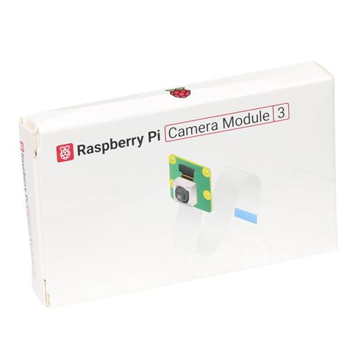

# Raspberry Pi Camera Module 3

Code snippets for Raspberry Pi Camera Module 3

<p align="center">
<picture>
  
</picture>
</p>

Quick commands for working on Raspberry Pi Camera Module 3:
- Preview the camera:
```
rpicam-hello
```
or
```
rpicam-hello -t 5000
```
_5000: millisecond_ -> 5 seconds


Watch more about this product on our [YouTube channel](https://www.youtube.com/@Roboticxps)

To get your own Raspberry Pi Camera Module 3, visit our online store: (Product Page)

* [Raspberry Pi Camera Module 3 – 12MP, Standard (75°)](https://roboticx.ps/product/raspberry-pi-camera-module-3-12mp-standard-75/)

----

Follow us on social media:

* Facebook: https://www.facebook.com/Roboticxps
* Instagram: https://www.instagram.com/roboticx.ps
* YouTube: https://www.youtube.com/@Roboticxps
* LinkedIn: https://www.linkedin.com/company/roboticx
